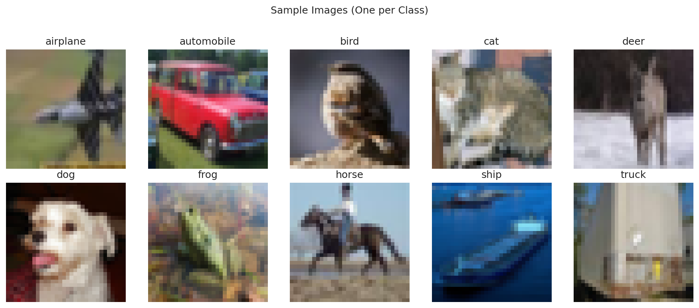
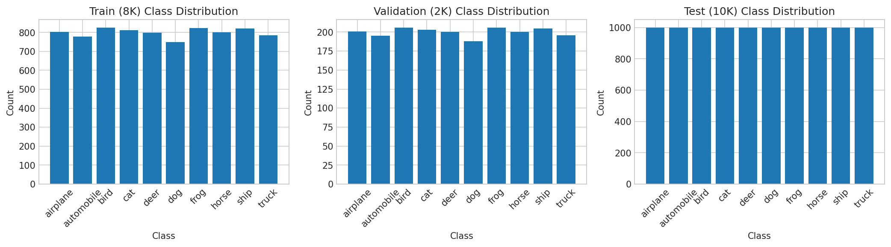
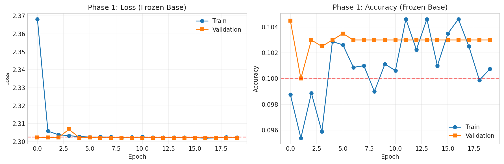
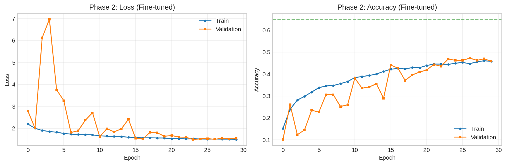
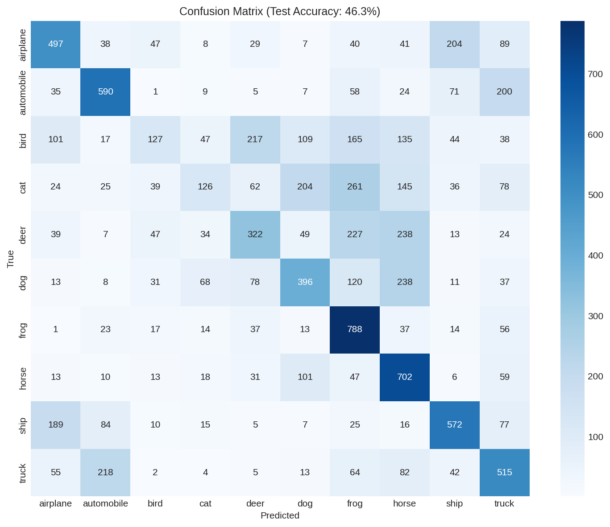
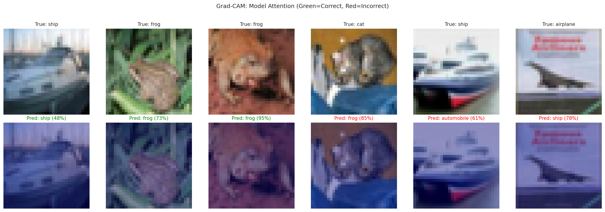
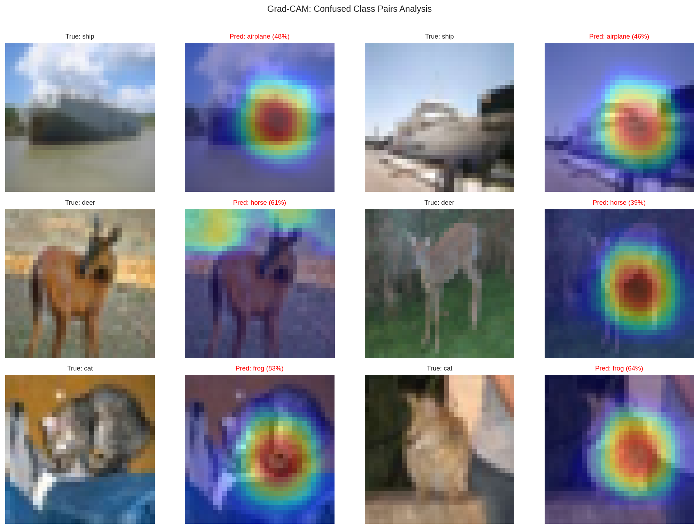

# CIFAR-10 Image Classification with ResNet50 Transfer Learning

> **Status:** Sprint 2 in progress - Production improvements underway

A deep learning project demonstrating transfer learning with ResNet50 on the CIFAR-10 dataset, including data augmentation, two-phase training, and model interpretability with Grad-CAM.

## Results

| Metric | Value |
|--------|-------|
| **Test Accuracy** | 48.9% |
| **Target** | 65% |
| **Performance Gap** | 16.1 pp |
| **Training Time** | ~77 minutes |

### Training Progression

The project uses a two-phase training approach:

| Phase | Description | Val Accuracy |
|-------|-------------|--------------|
| Phase 1 | Frozen ResNet50 base | 10.5% |
| Phase 2 | Fine-tuned conv5 block | 49.0% |

## Methodology

### Architecture

```
Input (32x32x3)
    ↓
Data Augmentation (RandomFlip, RandomRotation, RandomZoom)
    ↓
ResNet50 Preprocessing
    ↓
ResNet50 Base (ImageNet weights, frozen → conv5 unfrozen)
    ↓
Global Average Pooling
    ↓
Dropout(0.3) → Dense(256, ReLU) → Dropout(0.3) → Dense(10, Softmax)
    ↓
Output (10 classes)
```

### Sample Images

CIFAR-10 contains 10 classes of 32x32 color images:



### Class Distribution

Balanced dataset with 1,000 images per class in the test set:



### Data Augmentation

Applied during training to increase data diversity:


### Training Curves

**Phase 1 (Frozen Base):** Training failed with ~10% accuracy (random guessing), demonstrating that frozen ImageNet features don't transfer directly to 32x32 CIFAR-10 images.



**Phase 2 (Fine-tuning):** Unfreezing conv5 block enabled learning, reaching 49% validation accuracy.



### Model Evaluation

**Confusion Matrix:** Shows classification performance across all 10 classes.



**Top confusion pairs:**
- Ship → Airplane (237) - similar elongated shapes
- Deer → Horse (232) - similar body silhouettes
- Cat → Frog (218) - unexpected texture confusion

### Model Interpretability (Grad-CAM)

Grad-CAM visualizations show which image regions the model focuses on:

**Correct Predictions:**



**Confusion Analysis:**



## Key Findings

1. **Transfer learning requires input size compatibility** - ResNet50 (224x224) produced random-chance accuracy on native 32x32 CIFAR-10. Resizing was essential.

2. **Fine-tuning dramatically improves performance** - Unfreezing conv5 block improved accuracy from 10% to 49% (4.7x improvement).

3. **Architecture mismatch limits ceiling** - Upscaling 32x32→224x224 introduces interpolation artifacts. A CIFAR-specific architecture would be more appropriate.

4. **Class confusion follows visual similarity** - Ship/airplane, deer/horse pairs were most confused due to similar shapes at low resolution.

## Project Structure

```
computer_vision/
├── README.md
├── notebooks/
│   └── cifar10_classification.ipynb    # Main notebook (self-contained)
└── outputs/
    └── figures/                        # Generated visualizations
```

**Note:** This is a minimalistic repository. The notebook is self-contained and will auto-download the CIFAR-10 dataset and create necessary directories on first run.

## Quick Start

### Local Environment

```bash
# Clone repository
git clone https://github.com/albertodiazdurana/computer_vision.git
cd computer_vision

# Create virtual environment
python -m venv .venv
source .venv/bin/activate  # Linux/Mac
# .venv\Scripts\activate   # Windows

# Install dependencies
pip install tensorflow scikit-learn matplotlib seaborn jupyter

# Run notebook
jupyter notebook notebooks/cifar10_classification.ipynb
```

### Google Colab

1. Upload `notebooks/cifar10_classification.ipynb` to Colab
2. **Do NOT upload models/** - Keras version incompatibility (see Known Issues)
3. Run all cells (~77 min training time)

## Requirements

```
tensorflow>=2.10.0
scikit-learn
matplotlib
seaborn
numpy
```

Install with:
```bash
pip install tensorflow scikit-learn matplotlib seaborn numpy
```

- Python 3.10+ recommended
- GPU optional but recommended (~77 min training with GPU, slower on CPU)

## Known Issues

| Issue | Workaround |
|-------|------------|
| Keras model incompatibility in Colab | Train fresh in Colab; don't upload local models |
| 65% target not reached | Architecture mismatch; see Sprint 2 improvements |
| Training variance (44-49%) | Expected with small dataset and stochastic training |

## Sprint 2 Roadmap

Production-ready improvements planned:

- [ ] CIFAR-specific architecture (ResNet-20, WideResNet)
- [ ] Full 50K training set
- [ ] Advanced augmentation (Cutout, Mixup)
- [ ] Experiment tracking (MLflow/W&B)
- [ ] Model versioning and portable serialization
- [ ] CI/CD pipeline for documentation consistency

## Author

**Alberto Diaz Durana**

[](https://github.com/albertodiazdurana)
[](https://www.linkedin.com/in/albertodiazdurana/)

## License

This project is for educational purposes as part of a Computer Vision course.

---

*Last updated: 2025-12-18*
