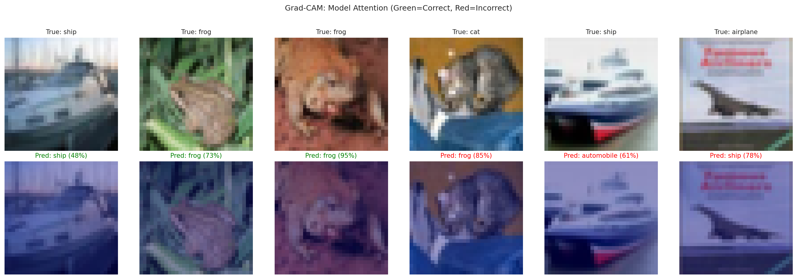
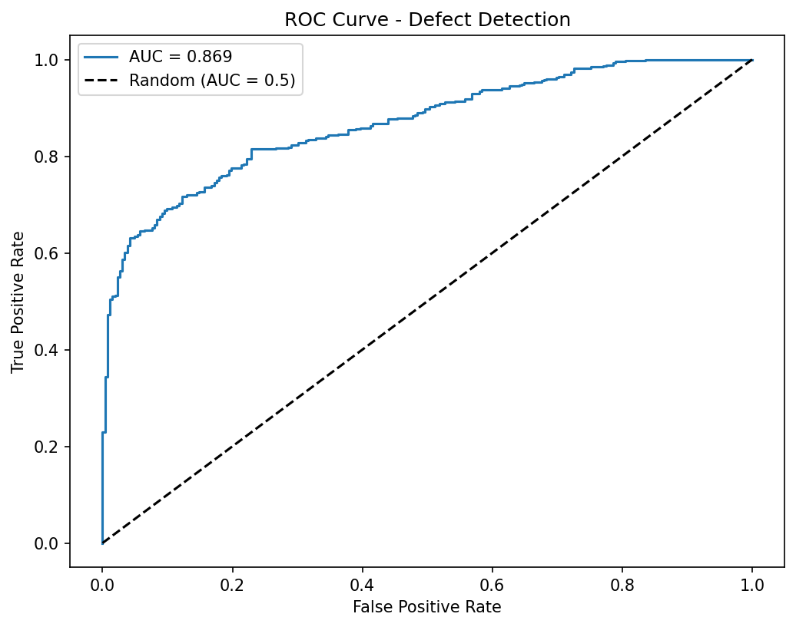
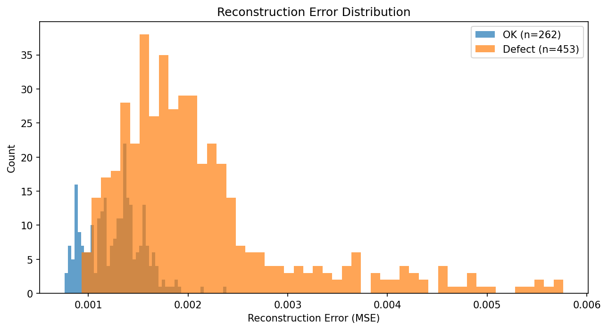

# Computer Vision for Manufacturing Analytics

> Deep learning projects demonstrating computer vision techniques applicable to manufacturing quality control and process optimization.

## Projects

### 1. Image Classification (CIFAR-10)

Transfer learning with ResNet50 for multi-class image classification.

| Metric | Value |
|--------|-------|
| Test Accuracy | 48.9% |
| Architecture | ResNet50 + custom head |
| Training | Two-phase (frozen → fine-tuned) |

**Manufacturing relevance:** Product categorization, defect classification



---

### 2. Defect Detection (Casting Products)

Anomaly detection using convolutional autoencoder trained only on "good" samples.

| Metric | Value |
|--------|-------|
| ROC-AUC | 0.869 |
| Accuracy | 77.5% |
| Precision (Defect) | 91% |

**Manufacturing relevance:** Quality inspection, surface defect detection



**Key insight:** No labeled defect data required for training - model learns "what good looks like" and flags anomalies.



---

### 3. Image Segmentation (Coming Soon)

U-Net architecture for pixel-level analysis.

**Manufacturing relevance:** Component localization, damage assessment

---

### 4. Manufacturing Dashboard (Coming Soon)

Streamlit app for production analytics visualization.

---

## Skills Demonstrated

- **Deep Learning:** CNN, Transfer Learning, Autoencoders, U-Net
- **Python:** TensorFlow/Keras, scikit-learn, matplotlib
- **MLOps:** MLflow experiment tracking, modular package design
- **Data Analysis:** ROC curves, confusion matrices, statistical metrics
- **Interpretability:** Grad-CAM, reconstruction error maps

---

## Project Structure

```
computer_vision/
├── src/cv_toolkit/          # Modular Python package
│   ├── config.py            # Configuration management
│   ├── data.py              # Data loading
│   ├── model.py             # Model architectures
│   ├── training.py          # Training with MLflow
│   ├── evaluation.py        # Metrics and visualization
│   └── gradcam.py           # Model interpretability
├── notebooks/
│   ├── cifar10_classification.ipynb
│   └── 02_defect_detection.ipynb
├── tests/                   # Unit tests (pytest)
├── config/                  # YAML configuration
└── outputs/figures/         # Generated visualizations
```

---

## Quick Start

```bash
# Clone repository
git clone https://github.com/albertodiazdurana/computer_vision.git
cd computer_vision

# Create virtual environment
python -m venv .venv
source .venv/bin/activate

# Install package
pip install -e .

# Run notebooks
jupyter notebook notebooks/
```

---

## Requirements

```
tensorflow>=2.10.0
mlflow>=2.0.0
scikit-learn
matplotlib
seaborn
numpy
pyyaml
```

---

## Author

**Alberto Diaz Durana**

[](https://github.com/albertodiazdurana)
[](https://www.linkedin.com/in/albertodiazdurana/)

---

*Last updated: 2026-01-09*
